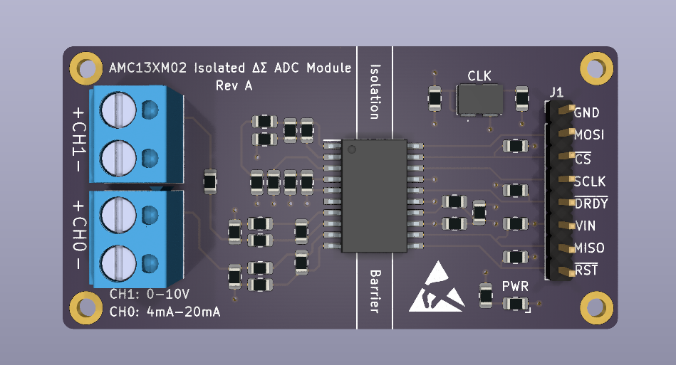
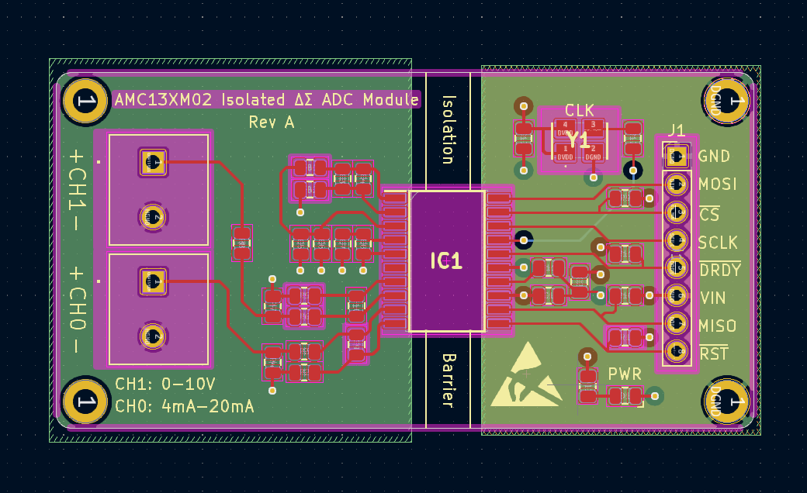

# AMC13XM0X-Module for Industrial Sensors

A PCB design for the [TI AMC13XM0X](https://www.ti.com/product/AMC131M02) $\Delta\Sigma$ ADC module. The module is designed to interface with industrial sensors that support 0-10V or 4-20mA output. This module features a voltage and current sensing network connected to the differential inputs of the ADC. The module is designed to be used over Serial Peripheral Interface (SPI) communication protocol. 

The module features a 4-layer PCB design with a 2.54mm pitch header for interfacing with the host controller. The module is powered by a 3V3 supply. The module is designed to be used in industrial applications where high accuracy and reliability are required. The module is designed to be used with the TI AMC13XM0X $\Delta\Sigma$ ADC.

# AMC13XM0X ADC Overview

The AMC13XMOX $\Delta\Sigma$ ADC is a high-precision, power isolated, simultaneous-sampling, 24-bit ADC. The AMC13XM02 features a fully integrated isolated DC/DC converter that allows single-supply operation from the low-side of the device. The reinforced and capactive isolation barrier is certified according to VDE V 0884-17 and UL1577. The isolation barrier is made of a $\text{Si}\text{O}_2$ barrier that provides $7070-V_{\text{PEAK}}$ reinforced isolation, per DIN EN IEC 60747-17. 